# COMFYWORKBENCH (BETA)

## Submit bug reports and feature requests here:

[Issue Tracker](https://github.com/backstube-gaming/ComfyWorkbench/issues)

                                                                                                                                                                                                  
                                                                                                                                                                                                  
   

# Main Features

Next level of ComfyUI image collection organization.

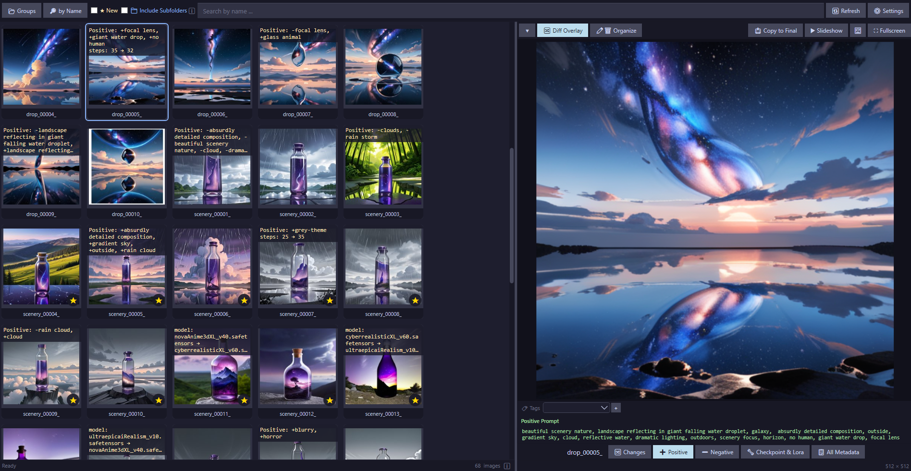

## The tool you did not know you needed when generating many images in ComfyUI. (not kidding)

- Queued up 200+ image generations and not sure what changed between the good and bad ones afterwards?
- Want to delete, rename, sort, and compare without losing track?
- Scrolling forever just to clean up output folders?

Then ComfyWorkbench is built for you!

## Core features (all included in Free)

### Workflow review and diffing

- Automatically track new images.
- Direct workflow insights.
- Diff Overlay: see model, prompt differences between successive images at a glance.
- LoRA values panel: easily see and compare LoRA settings between images.

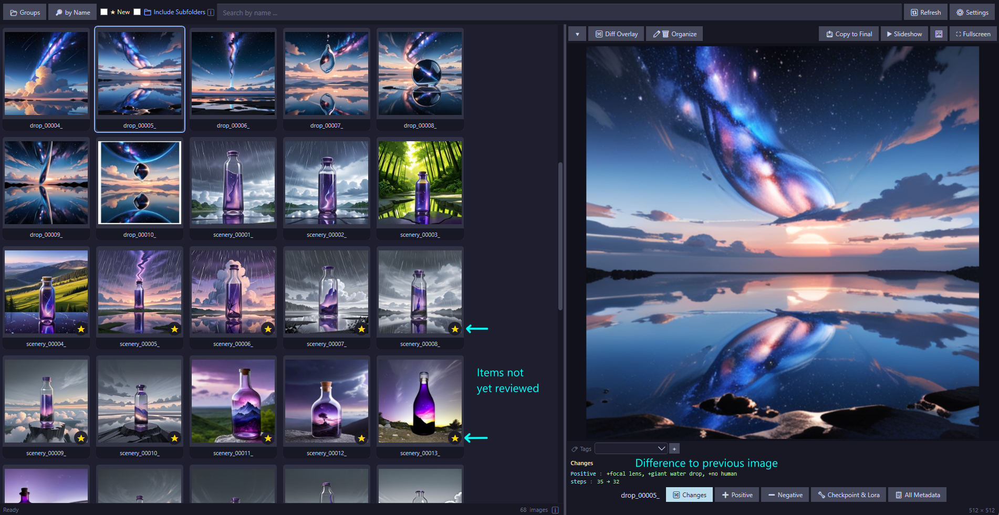
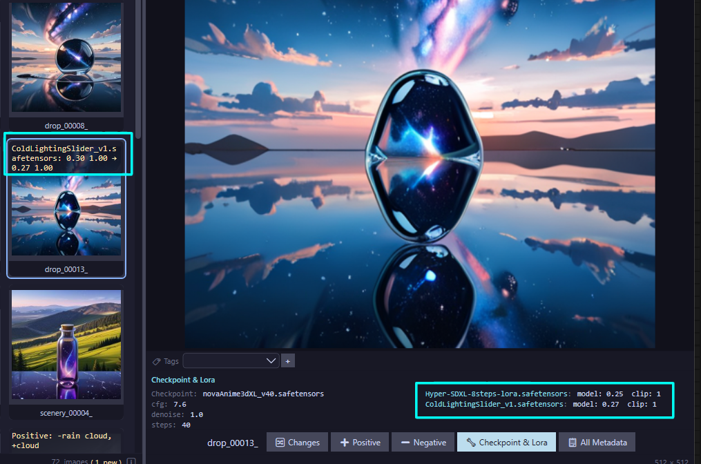
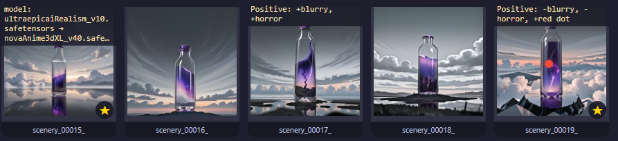

### Cleanup and organization

- Fast delete flow: clear weak generations quickly.
- Accident-safe multi-selection: never lose your selection again with an accidental misclick, including undo/redo support.
- Rename many files at once: re-organize your images, even supporting prefix or regex patterns.

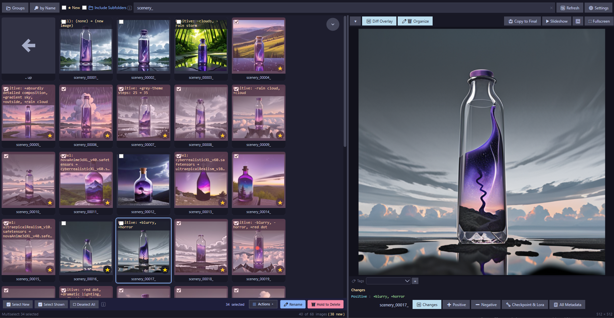
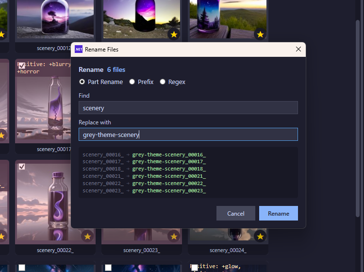

### Search, metadata, and workflow handling

- Search by name or automatically created name clusters.
- Full metadata access: view complete workflow information from any image.
- Customizable keybinds: rebind keyboard shortcuts to your preference.
- Drag and drop images directly from ComfyWorkbench into ComfyUI, a new folder, or other apps.
- Designed to handle large amounts of images (tested with 15k+).
- Manage multiple locations without loosing your progress.
- Supports workflow extraction for: PNG, WEBP. Organization features support PNG, JPG, JPEG, BMP, GIF, TIF/TIFF, ICO, and WDP/JXR/HDP.

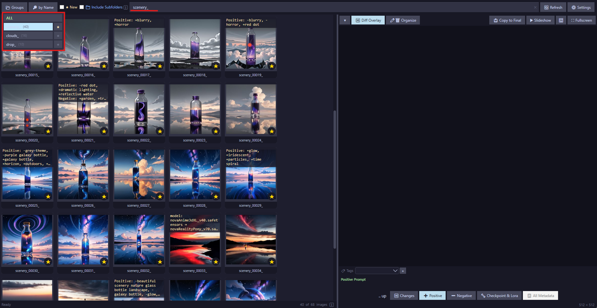
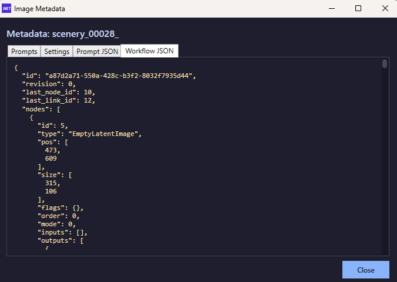
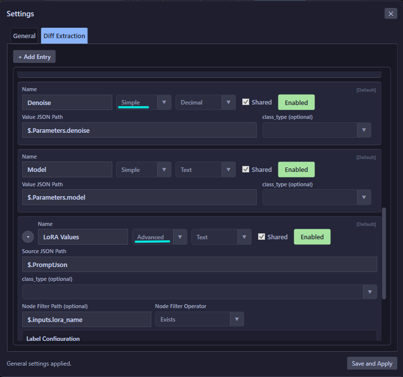
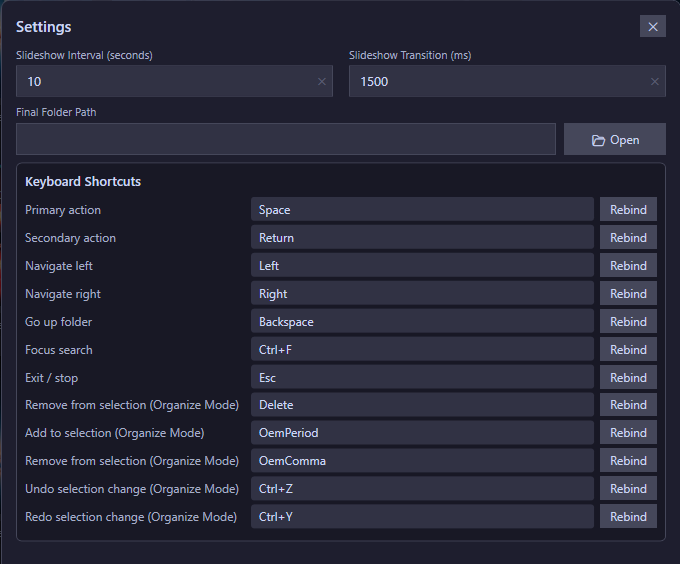

## Compare mode

Compare candidates side-by-side and make faster decisions when refining images.

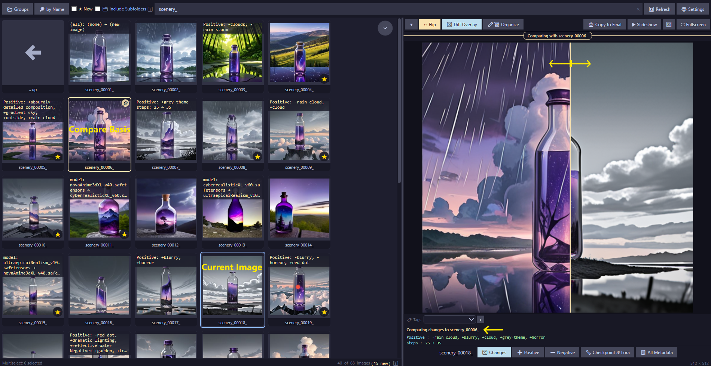

## Full version (one-time payment, lifetime unlock - including updates)

- Advanced search (full-text ComfyUI workflow search and tag search).
- Refine images by directly comparing them to a Base-image.
- Pop-out images into picture frames.
- Subfolder support.
- Tag your images.
- Favorite filename groups and tag groups.
- One-click move to Final folder.
- Adjustable slideshow timing.
- Buys us more coffee!
- Priority bug-fix and feature-request consideration.

Always try the Free Edition first to make sure ComfyWorkbench is fully compatible with your machine and workflows.

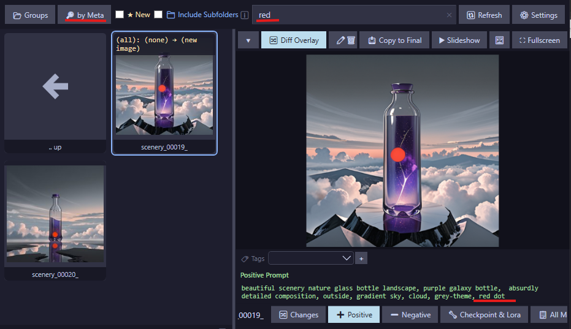
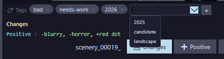
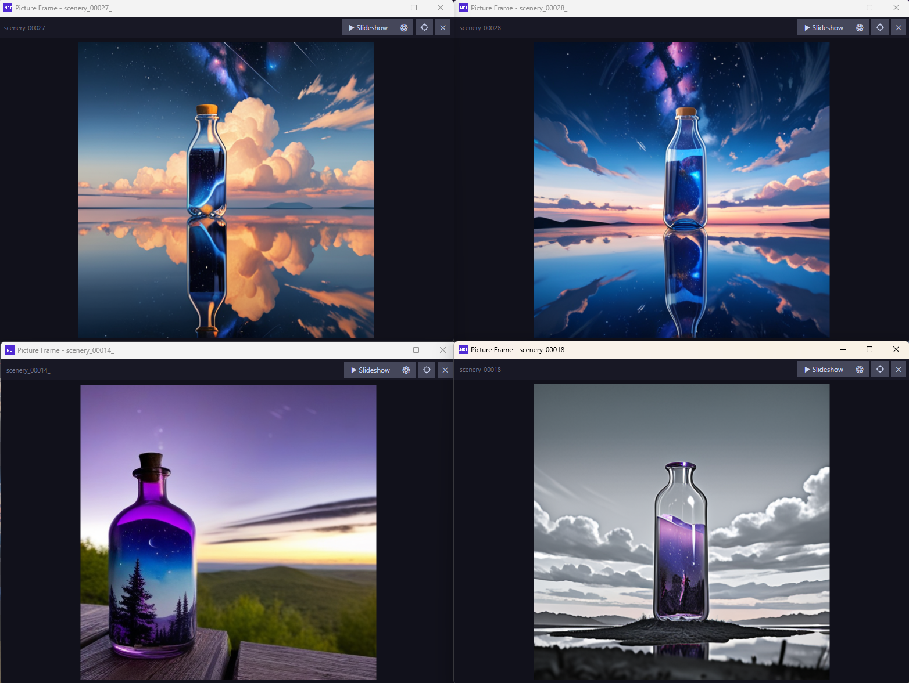

## 100% Local and Private

- Runs locally with no ads.
- GDPR-conscious approach. All App-managed cache data is fully encrypted. \*
- Designed to also support professional NDA-bound workflows without restrictions. \*

Note: \* drag and drop naturally exposes the full path of the dragged file to the OS and the target app. For full GDPR compliance, ensure the used hard drive is encrypted as well, for example with BitLocker.

## Current limitations

- Currently Windows only.
- Performance tests with low RAM PCs were limited.
- Some custom nodes may not work properly yet, though almost all should be possible to use with the custom extractions. Request specific node support via the GitHub issue tracker.

## Requirements

- Windows 10 or 11.
- 8 GB RAM minimum (lower amounts not fully tested).

## Try it

If your ComfyUI output folder is becoming chaos, start with ComfyWorkbench Free. Point it to your folder, review with Diff Overlay, and keep only the images that matter.
